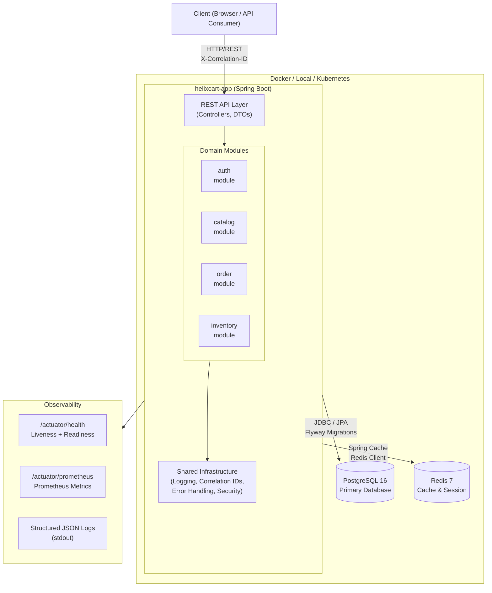

# Diagram: Base Modular Monolith Architecture

## Notes

- All four domain modules are in a single deployable JAR.
- Phase 2 is implementing these module internals incrementally, starting with Catalog products/categories and Inventory stock reservations.
- Each module has its own package hierarchy and database schema (via Flyway).
- Modules communicate through Java interfaces — no direct cross-module class coupling.
- This design enables future service extraction without architectural rewrites.

## Evolution

In Phase 3, the API Gateway will be introduced in front of this application.
In Phase 5, individual modules will be extracted into separate services when justified.
